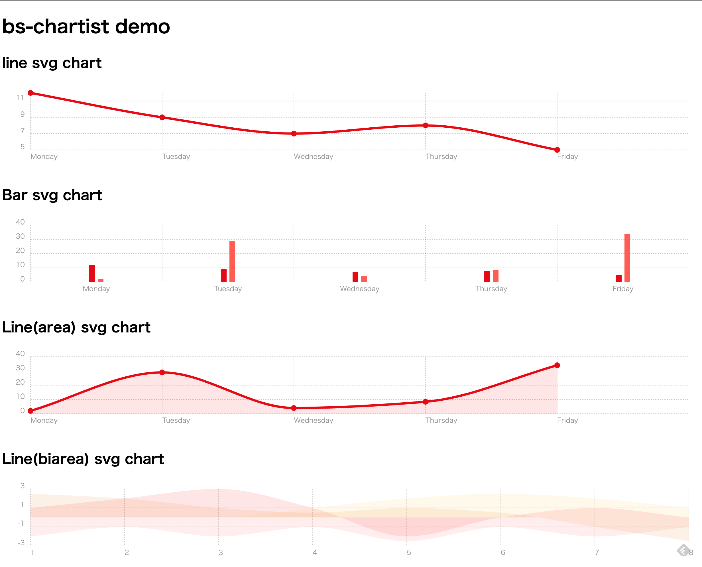

bs-chartist [](https://github.com/mamewotoko/bs-chartist/actions/workflows/gh-pages.yml)
======================

A BuckeScript bindings of [CHARTIST.JS](https://gionkunz.github.io/chartist-js/)


Setup
-------

```
npm i
```

Build
-------

```
./build.sh
```

Demo
-----

[](https://mamewotoko.github.io/bs-chartist/)

Run web server

```
npm run serve
```

then browse <http://localhost:8080/examples/index.html> [examples/index.html](examples/index.html)

References
-----------------
* [CHARTIST.JS](https://gionkunz.github.io/chartist-js/)
* [bs-chart](https://github.com/mamewotoko/bs-chart)
  * A BuckeScript bindings of [Chart.js](https://www.chartjs.org/)

-------
Takashi Masuyama < mamewotoko@gmail.com >

https://mamewo.ddo.jp/
